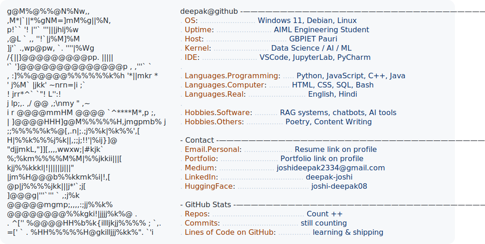

<a href="https://github.com/Deepak-J0shi">
  <picture>
    <source media="(prefers-color-scheme: dark)" srcset="dark_mode.svg">
    
  </picture>
</a>

  <a href="https://drive.google.com/file/d/18rns2ID7A2eeqXndBV3LUZe86v4OoxTh/view?usp=sharing" target="_blank">
    Resume
  </a>
  &nbsp;•&nbsp;
  <a href="https://portfolio-main-tan-three.vercel.app/" target="_blank">
    Portfolio
    </a>
  &nbsp;•&nbsp;
  <a href="https://www.linkedin.com/in/deepak-joshi-417570293/" target="_blank">
    LinkedIn
  </a>
  &nbsp;•&nbsp;
  <a href="https://huggingface.co/joshi-deepak08" target="_blank">
    HuggingFace
  </a>
  &nbsp;•&nbsp;
  <a href="https://medium.com/@Deepak-J0shi" target="_blank">
    Medium
  </a>
  &nbsp;•&nbsp;
  <a href="https://authors-page-iota.vercel.app/" target="_blank">
    Author's-Page
  </a>

<h3 align="center"><i> Author of "I Was Never Me After You" – Now Live on Amazon </i></h3>

  <h4<i> Grab Yours Now </i></h4>
</a>
  &nbsp;•&nbsp;
  <a href="https://amzn.in/d/0cNeeE6D" target="_blank">
    I Was Never Me After You
  </a>

